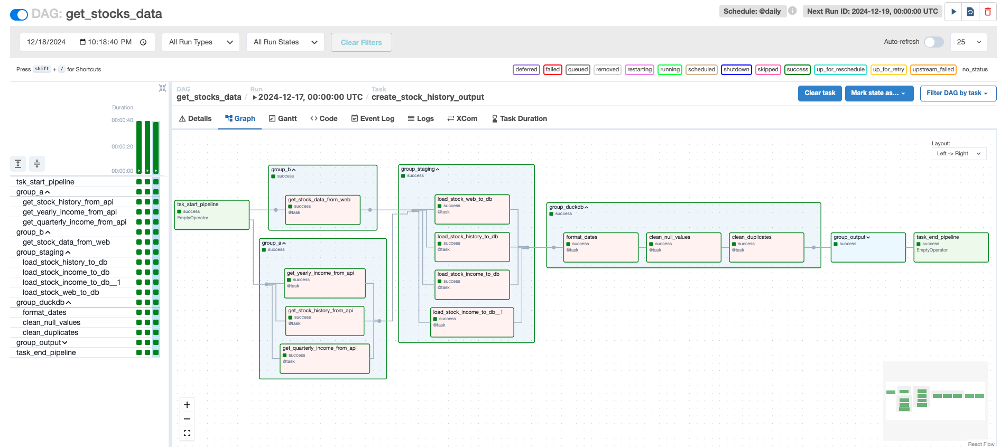
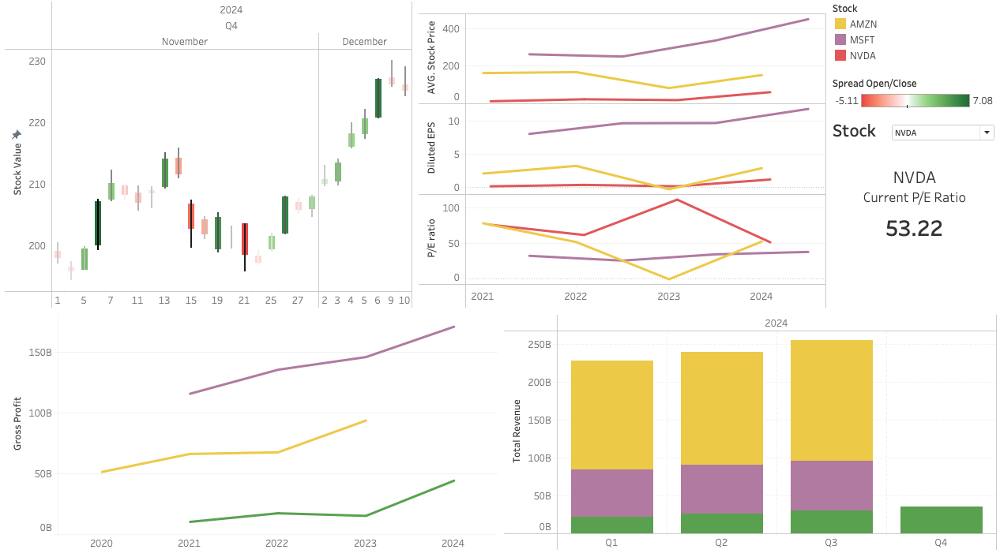

# Financial Market Pipeline

The **Financial Market Pipeline** is a data pipeline designed to streamline the ingestion, processing, and storage of financial market data. This pipeline leverages Apache Airflow for orchestration, AWS RDS for structured data storage, and AWS S3 for scalable storage solutions. The system is configured to handle data efficiently while ensuring reliability and scalability for financial data workflows.

This guide will walk you through setting up the development environment, configuring Airflow, and connecting to essential resources like AWS RDS and S3.


Here's the project walkthrough video: *[financial-data-pipeline-video](https://drive.google.com/file/d/1VB3eIfwOspkHoDYjEjO8d1ZlL-ltPeq-/view?usp=sharing)*

## How the pipeline works?
To track specific stocks, a list of desired stocks must be provided in CSV format and placed in the `input` folder within the `dags` directory. The entire pipeline is orchestrated using Apache Airflow. The pipeline then performs the following steps:

1. **Data Extraction**: It collects data for the specified stocks using the Yahoo Finance API and custom web scraping scripts.
2. **Staging**: The extracted data is stored in an AWS RDS instance as a staging area.
3. **Data Cleaning and Querying**: DuckDB is used to clean and process the data.
4. **Final Output**: The processed data is saved as CSV files in an AWS S3 bucket.
5. **Further Analysis**: The final data can be used for additional analysis and visualization in tools like Tableau.

This pipeline ensures a seamless workflow from raw data collection to actionable insights for financial analysis.


## Setting Up the Environment
To get started, follow the steps below to prepare your infrastructure and Airflow environment.


## Prerequisites
Ensure you have the following installed on your system before starting:

- Python 3.12+
- pip
- Terraform
- AWS CLI configured with your credentials

## Setting Up Development Variables
Define the following development variables in a `dev.tfvars` file:

```terraform
postgres_identifier   = "your-postgres-instance"
postgres_db_user_name = "postgres"
postgres_db_password  = "your-password"
postgres_port         = 5432
```

## Initializing and Applying Terraform
Navigate to the Terraform directory and initialize Terraform:

```bash
terraform init
```

Apply the Terraform plan with the development variables:

```bash
terraform apply -var-file=dev.tfvars
```

## Setting Up the AWS Instance
After connecting to your AWS instance, update the package manager and install Python dependencies:

```bash
sudo apt update
sudo apt install python3-pip
sudo apt install python3.12-venv
```

Create a virtual environment for Airflow:

```bash
python3 -m venv airflow_venv
source airflow_venv/bin/activate
mkdir airflow
```

## Installing Airflow Dependencies
Copy the `requirements.txt` file to the `airflow` directory and install the dependencies:

```bash
pip install -r requirements.txt
```

## Configuring Airflow
Navigate to the `airflow` directory and set up the Airflow database:

```bash
export AIRFLOW_HOME=/home/ubuntu/airflow
echo $AIRFLOW_HOME
airflow db init
```

### Update Airflow Configuration
Edit the `airflow.cfg` file to set the following:

```text
executor = LocalExecutor
sql_alchemy_conn = postgresql+psycopg2://{your_rds_user}:{your_rds_password}@{your_rds_host}:5432/{your_rds_database}
```

Replace the placeholders with your PostgreSQL RDS instance details.

## Creating an Airflow Admin User
In the AWS CLI, create an admin user for Airflow:

```bash
airflow users create --username airflow --firstname firstname --lastname lastname --role Admin --email airflow@domainairflow.com --password airflow
```

## Adding Airflow Connections
### PostgreSQL Connection
Configure the PostgreSQL connection in Airflow:

```bash
airflow connections add 'postgres_conn' \
    --conn-type 'postgres' \
    --conn-host 'rds-host-address' \
    --conn-login 'postgres' \
    --conn-password 'your-password' \
    --conn-port '5432' \
    --conn-schema 'financialdb'
```

### S3 Connection
Define the following environmental variables to connect to your S3 bucket:

```bash
export AWS_ACCESS_KEY_ID="your-access-key-id"
export AWS_SECRET_ACCESS_KEY="your-secret-access-key"
export AWS_REGION="your-region"
```

Update the S3 bucket path in the `duckdb.queries.py` file:

```python
OUTPUT_PATH_BASE = "s3://financial-s3-bucket-xxxxxxxx"
```

## Running Airflow
Start the Airflow webserver and scheduler:

```bash
airflow webserver &
airflow scheduler
```

## Accessing the Airflow UI
Open your browser and navigate to the following URL:

```
[your Public IPv4 DNS]:8080
```

Log in using the admin credentials you created earlier.

## Notes
- Ensure the AWS instance security group allows inbound traffic on port `8080` for accessing the Airflow UI.
- Replace all placeholder values (`your-access-key-id`, `your-region`, etc.) with your actual configuration details.


## The piepeline overall structure in Airflow


## The Tableau results


## Challenegs and what I learned from them?

### Handling Invalid Stock Symbols
One of the challenges faced during development was dealing with cases where the HTTP status code returned was 200, but the input stock symbol was invalid. This caused unnecessary requests to the web scraping function and led to errors or incomplete data extraction.

To address this issue, I implemented a pre-validation step for stock symbols before sending requests for data extraction. By checking the validity of stock symbols in advance using a lightweight script, I was able to ensure that only valid symbols were passed on to the web scraping function. This not only improved the accuracy of the pipeline but also optimized its performance by reducing redundant requests.

For example, the validation logic identifies valid stock symbols by making a preliminary request to verify their existence on the NASDAQ listing. If a stock symbol is confirmed to be valid, it is added to the processing queue. This approach is encapsulated in the script `nasdaq_webscraping.py`, which forms a key component of the pipeline's preprocessing stage.

This process helped me better understand the importance of input validation and designing robust pre-processing mechanisms to handle edge cases in data pipelines.

### Concurrency Issues with DuckDB
Another challenge was handling concurrency problems with the in-memory DuckDB database. DuckDB does not natively support multiple processes writing to the same database file concurrently. When parallel tasks in Airflow attempted to access the database simultaneously, the following issues were observed:

1. **Database Lock Errors**: One process would lock the database, preventing others from accessing it, causing errors like: `Could not set lock on file ... Conflicting lock is held.`
2. **Missing Tables**: Tasks dependent on previous ones would fail due to incomplete table creation, showing errors like: `Table with name cleaned_stocks_yearly_income does not exist!`

To resolve this:
1. **Persistent Storage**: To address the concurrency issue with DuckDB more effectively, I also switched from using an in-memory database to a persistent mode database. This change ensures that the database state is stored on disk, allowing tasks to access the same consistent data without conflicts.
2. **Open/Close Connections**: Each task now explicitly opens and closes its connection to the DuckDB database, ensuring no lingering locks.
3. **Task Dependencies**: Proper task dependencies were enforced in Airflow. For instance, the `create_formatted_date()` task is set to complete successfully before the `remove_null_values()` task starts, ensuring all required tables exist and are accessible.

This solution not only resolved the concurrency issue but also reinforced the importance of designing pipelines with clear task dependencies and efficient resource management.


